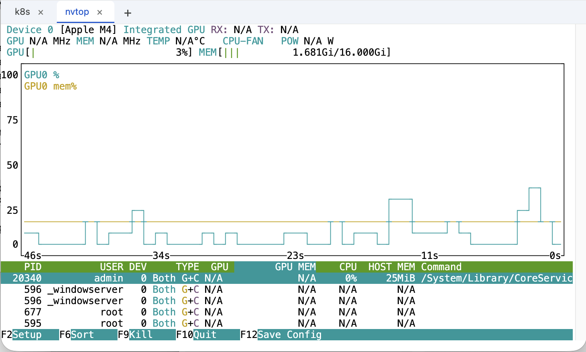

# Web Terminal

Browser-based terminal served over WebSocket. Each connection spawns an
independent PTY-backed shell session.



## Architecture

```
Browser (xterm.js)  ←—WebSocket—→  server.py  ←—PTY—→  shell
```

- **`server.py`** — aiohttp server: serves the UI, handles WebSocket
  connections, spawns/manages PTY child processes, relays I/O as binary frames.
  Supports Linux/macOS (via `pty`/`fork`) and Windows (via `pywinpty`).
- **`static/index.html`** — Terminal frontend using xterm.js with the FitAddon
  (auto-resize via ResizeObserver) and CanvasAddon.
- **`static/js/websocket-client.js`** — WebSocket client wrapper.
- **`static/js/terminal-connection.js`** — Bridges WebSocket and xterm.js.
- **`static/js/terminal-ui.js`** — Terminal UI setup, themes, and addons.

## Quick Start

```bash
pip install -r requirements.txt
python server.py
```

On startup the server prints all accessible URLs (like Jupyter):

```
Web Terminal Server
  Shell: /bin/bash
  Max connections: 4

Access URLs:
    http://localhost:8888/
    http://192.168.1.5:8888/
```

With `--token`, URLs include the token as a query parameter for one-click access:

```
Access URLs:
    http://localhost:8888/?token=abc123xyz
    http://192.168.1.5:8888/?token=abc123xyz
```

## Options

| Flag | Default | Description |
|------|---------|-------------|
| `--port` | 8888 | Listen port |
| `--host` | 0.0.0.0 | Bind address |
| `--shell` | `/bin/bash` (Linux/macOS), `cmd.exe` (Windows) | Shell to spawn per session |
| `--token` | *(disabled)* | Generate a random access token; printed to stdout on startup |
| `--max-connections` | 4 | Maximum concurrent sessions (0 = unlimited) |
| `--cert` | *(disabled)* | Path to TLS certificate file (enables HTTPS/WSS) |
| `--key` | *(auto)* | Path to TLS private key (defaults to cert path with `.key` extension) |

## Windows Support

On Windows, the server uses `pywinpty` to spawn `cmd.exe` (or any shell passed
via `--shell`). This dependency is included in `requirements.txt` and only
installed on Windows systems.

## Authentication

Without `--token`, anyone who can reach the port can connect (tokenless mode).

With `--token`, the server generates a random URL-safe token and prints it at
startup. Clients must pass it as a `?token=` query parameter on the WebSocket
URL. Connections without a valid token receive HTTP 403.

The web UI reads the token from the URL on page load, populates the password
field, and strips the token from the address bar (via `history.replaceState`)
to prevent shoulder-surfing or leaking via browser history.

## Copy Mode

The UI has a **Copy** button for selecting terminal text when mouse reporting
is active (e.g., inside vim or tmux). Clicking it overlays selectable text
matching the terminal grid. After copying (Cmd+C / Ctrl+C), the overlay
auto-dismisses.

## TLS

To enable HTTPS/WSS, pass `--cert`:

```bash
python server.py --cert cert.pem --key key.pem
```

If `--key` is omitted, the server looks for a file with the same name as the
cert but with a `.key` extension (e.g., `cert.pem` → `cert.key`).

To generate a self-signed certificate for local development:

```bash
openssl req -x509 -newkey rsa:2048 -nodes \
  -keyout cert.key -out cert.pem \
  -days 365 -subj '/CN=localhost'
```

## Connection Limit

The server allows at most 4 concurrent sessions by default. Additional
connections receive HTTP 503. Configure with `--max-connections`:

```bash
python server.py --max-connections 8    # allow 8 sessions
python server.py --max-connections 0    # unlimited
```

## Resize Handling

The frontend uses a `ResizeObserver` on the terminal container. When the
container dimensions change:

1. `fitAddon.fit()` recalculates cols/rows from pixel dimensions
2. xterm.js `onResize` fires → client sends `{"cols": N, "rows": M}` over WS
3. Server calls `TIOCSWINSZ` on the PTY fd (Linux/macOS) or `setwinsize` (Windows)
4. Shell receives `SIGWINCH` and adapts

## Wire Protocol

See [PROTOCOL.md](PROTOCOL.md) for frame-level details.

**Client → Server (JSON text frames):**
- `{"data": "..."}` — terminal input
- `{"cols": N, "rows": M}` — resize

**Server → Client (binary frames):**
- Raw PTY output bytes (UTF-8)

## Sessions

Each WebSocket connection is an independent session with its own shell process.
Disconnecting kills the shell. There is no session persistence — use tmux/screen
inside the terminal if you need to survive disconnects.
